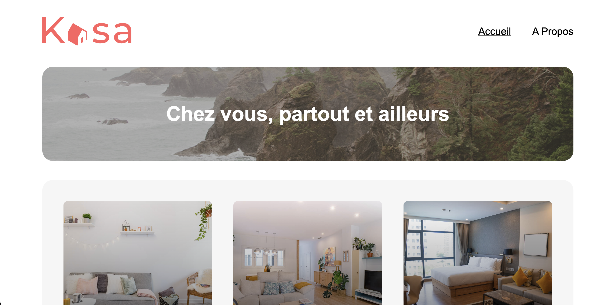

# Kasa

- Ce travail a été réalisé dans le cadre du projet n°7 de la formation Intégrateur Web d’OpenClassrooms.

### Contexte :
- Kasa est l'un des leaders de la location d'appartements entre particuliers en France.
- L'objectif de ce projet était de réaliser la refonte totale du site web en utilisant une architecture moderne :
    - • création d'une application web complète avec **React**,
    - • gestion d'une navigation fluide avec **React Router**,
    - • développement d'interfaces dynamiques et responsives (composants, carrousels, accordéons).

### Installation

Pour lancer le projet localement :
1. Cloner le dépôt GitHub.
2. Installer les dépendances : `npm install`
3. Lancer l'application : `npm start`
4. L'application est alors accessible à l'adresse : `http://localhost:5173`

## Outils et langages pour la réalisation du projet

- Le projet a été réalisé en **HTML**, **CSS (Sass)**, **JavaScript** et **React**.
- La navigation est gérée avec **React Router**.
- L'application est développée sans back-end, en utilisant un fichier JSON pour les données.

